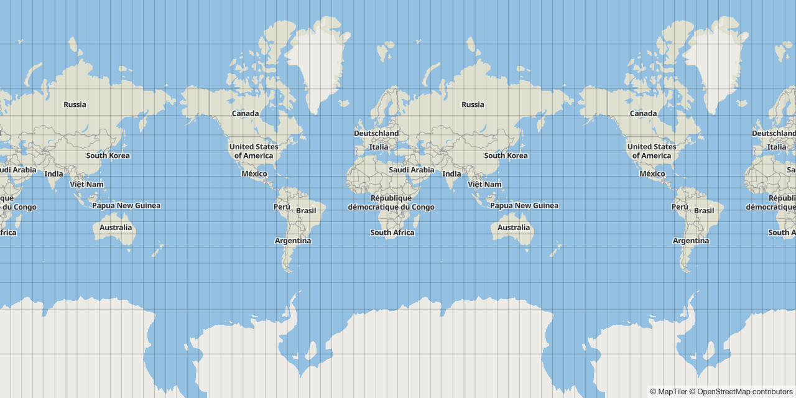

# maplibre-grid

Grid / graticule plugin for MapLibre GL JS / Mapbox GL JS

[Demo](https://labs.maptiler.com/maplibre-grid/)



## Install

```
npm install maplibre-gl maplibre-grid
```

or

```
<script src="https://unpkg.com/maplibre-gl@1.13.0-rc.5/dist/maplibre-gl.js"></script>
<link href="https://unpkg.com/maplibre-gl@1.13.0-rc.5/dist/maplibre-gl.css" rel="stylesheet">
<script src="https://unpkg.com/maplibre-grid@1.0.0/dist/maplibre-grid.js"></script>
```

## Usage

```
import Maplibre from 'maplibre-gl';
import * as MaplibreGrid from 'maplibre-grid';
```

### API

```
export interface GridConfig {
  gridWidth: number;
  gridHeight: number;
  units: Units;
  minZoom?: number;
  maxZoom?: number;
  paint?: maplibregl.LinePaint;
}

const grid = new MaplibreGrid.Grid(config: GridConfig);
```

- `gridWidth` - number, **required**
- `gridHeight` - number, **required**
- `units` - 'degrees' | 'radians' | 'miles' | 'kilometers', grid width/height units, **required**
- `minZoom` - number, min zoom to display the grid
- `maxZoom` - number, max zoom to display the grid
- `paint` - maplibregl.LinePaint, layer line paint properties

Multiple grids can be added to display major and minor grid together, or different grids depending on zoom level.

### Basic

```
const grid = new MaplibreGrid.Grid({
  gridWidth: 10,
  gridHeight: 10,
  units: 'degrees',
  paint: {
    'line-opacity': 0.2
  }
});
map.addControl(grid);
```

### Multiple grids

```
const grid1 = new MaplibreGrid.Grid({
  gridWidth: 10,
  gridHeight: 10,
  units: 'degrees',
  paint: {
    'line-opacity': 0.2
  }
});
map.addControl(grid1);

const grid2 = new MaplibreGrid.Grid({
  gridWidth: 5,
  gridHeight: 5,
  units: 'degrees',
  paint: {
    'line-opacity': 0.2
  }
});
map.addControl(grid2);
```
### Click event

```
map.on(MaplibreGrid.GRID_CLICK_EVENT, event => {
  console.log(event.bbox);
});
```

Click event can be used to implement grid cell selection. Create a polygon feature from `event.bbox`, and add it to your custom layer. See [demo](https://labs.maptiler.com/maplibre-grid/) for details.

### Destroy

```
map.removeControl(grid);
```
